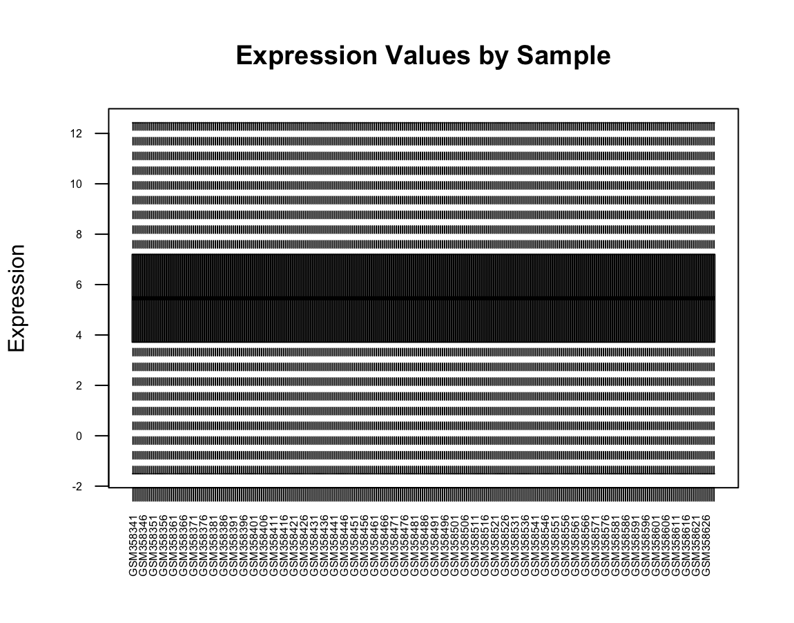

`boxplot(exprs_data, outline=FALSE, las=2, cex.axis=0.5, main="Expression Values by Sample", ylab="Expression")`

# Calculate medians and variances for each sample (column)
# Set up plotting area for 3 plots side by side
oldpar <- par(mfrow = c(1, 3))

# Boxplot for all samples
boxplot(exprs_data, main = "All Samples")

# Boxplot for first 30 samples
boxplot(exprs_data[, 1:30], main = "First 30 Samples")

# Calculate medians and variances
sample_med <- apply(exprs_data, 2, median)
sample_var <- apply(exprs_data, 2, var)

# Plot medians
plot(sample_med, type = "b", col = "blue", ylab = "Value", xlab = "Sample",
     main = "Sample Medians and Variances", ylim = range(c(sample_med, sample_var)))
# Add variances to the same plot
lines(sample_var, type = "b", col = "red")
# Add legend
legend("topright", legend = c("Median", "Variance"),
       col = c("blue", "red"), lty = 1, pch = 1)

# Restore previous plotting parameters
par(oldpar)
